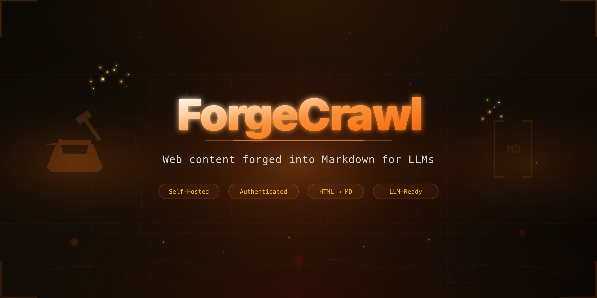

<p align="center">
  
</p>

# ForgeCrawl

Self-hosted, authenticated web scraper that converts website content into clean Markdown optimized for LLM consumption.

## Current Status: Phase 1 Complete

Phase 1 (Foundation & Auth) is fully implemented and tested. The app is functional for single-URL HTTP scraping with built-in authentication.

### What Works Now

- First-run admin registration (one-time `/setup` flow)
- Login/logout with JWT sessions (configurable 15-day expiry)
- Single-URL scraping via HTTP fetch
- Content extraction (Mozilla Readability with full-body fallback)
- HTML-to-Markdown conversion (Turndown + GFM)
- YAML frontmatter with metadata (canonical URL, description, timestamps, etc.)
- Result caching (configurable TTL, bypass option)
- Scrape history with detail view
- Copy to clipboard and download as `.md`
- Delete scrapes
- Sitemap detection (notification only — crawling is Phase 3)
- Auto `https://` prefix on URLs
- SSRF protection (private IPs, localhost, cloud metadata, DNS resolution check)
- Login rate limiting (5 attempts per email per 15 minutes)
- Health check endpoint (no auth required)
- Docker Compose deployment
- PM2 bare-metal deployment

### What's Not Built Yet

- **Phase 2:** Puppeteer JS rendering, filesystem storage, PDF/DOCX extraction
- **Phase 3:** Job queue, multi-page site crawling, robots.txt
- **Phase 4:** API key auth, multi-user management
- **Phase 5:** RAG chunking, login-gated scraping, export formats

## Quick Start — Development

```bash
# Prerequisites: Node.js 22+, pnpm
git clone https://github.com/ICJIA/forgecrawl
cd forgecrawl
pnpm install

# Generate an auth secret (or let Docker auto-generate one)
cp .env.example .env
node -e "console.log('NUXT_AUTH_SECRET=' + require('crypto').randomBytes(32).toString('hex'))" >> .env

# Start dev server
pnpm dev
# Visit http://localhost:3000
# Register admin account on first visit
```

## Quick Start — Docker Compose

```bash
git clone https://github.com/ICJIA/forgecrawl
cd forgecrawl
docker compose up -d
# Visit http://localhost:3000
# Auth secret auto-generates if not set
```

## Quick Start — Bare Metal (PM2)

```bash
git clone https://github.com/ICJIA/forgecrawl
cd forgecrawl
pnpm install
cp .env.example .env
# Edit .env and set NUXT_AUTH_SECRET (min 32 chars)

pnpm build
pm2 start ecosystem.config.cjs
pm2 save && pm2 startup
```

See [`ecosystem.config.cjs`](ecosystem.config.cjs) for PM2 tuning options.

## Project Structure

```
forgecrawl/
├── forgecrawl.config.ts        # Public config (ports, timeouts, session, etc.)
├── docker-compose.yml
├── ecosystem.config.cjs        # PM2 config (bare-metal deployment)
├── pnpm-workspace.yaml
├── .env                        # Secrets only (gitignored)
├── .env.example                # Secret key templates
├── packages/
│   └── app/                    # Nuxt 4 application
│       ├── nuxt.config.ts
│       ├── Dockerfile
│       ├── drizzle.config.ts
│       ├── app/                # Client (Nuxt 4 srcDir)
│       │   ├── pages/          # setup, login, index, scrapes/[id]
│       │   ├── composables/    # useAuth
│       │   ├── middleware/     # setup.global (auth + setup routing)
│       │   └── assets/css/
│       └── server/
│           ├── api/            # health, auth/*, scrape, scrapes/*
│           ├── middleware/     # JWT auth middleware
│           ├── engine/         # scraper, fetcher, extractor, converter, cache
│           ├── db/             # schema, migrations, init
│           ├── auth/           # password (bcrypt), jwt (jose)
│           └── utils/          # SSRF validation, rate limiter
└── docs/                       # Design documents
```

## API

```bash
# Health check (no auth)
curl http://localhost:3000/api/health

# Login
curl -X POST http://localhost:3000/api/auth/login \
  -H "Content-Type: application/json" \
  -d '{"email":"you@example.com","password":"yourpassword"}' \
  -c cookies.txt

# Scrape a URL
curl -X POST http://localhost:3000/api/scrape \
  -H "Content-Type: application/json" \
  -b cookies.txt \
  -d '{"url": "https://example.com"}'

# Scrape with cache bypass
curl -X POST http://localhost:3000/api/scrape \
  -H "Content-Type: application/json" \
  -b cookies.txt \
  -d '{"url": "https://example.com", "bypass_cache": true}'

# List scrapes
curl http://localhost:3000/api/scrapes -b cookies.txt

# Get scrape detail
curl http://localhost:3000/api/scrapes/{job_id} -b cookies.txt

# Delete a scrape
curl -X DELETE http://localhost:3000/api/scrapes/{job_id} -b cookies.txt
```

## Configuration

Public configuration lives in [`forgecrawl.config.ts`](forgecrawl.config.ts) (single source of truth). Key settings:

| Setting | Default | Description |
|---------|---------|-------------|
| `server.port` | 3000 | HTTP port |
| `storage.mode` | database | Where results are stored |
| `scrape.timeout` | 30000 | Page fetch timeout (ms) |
| `scrape.cacheTtl` | 3600 | Cache TTL in seconds (0 to disable) |
| `auth.sessionMaxAge` | 1296000 | JWT/cookie lifetime (15 days in seconds) |
| `rateLimit.loginMaxAttempts` | 5 | Failed logins before lockout |
| `rateLimit.loginWindowMs` | 900000 | Lockout window (15 minutes) |

Secrets go in `.env` (gitignored):

```bash
NUXT_AUTH_SECRET=         # Min 32 chars, signs JWTs
NUXT_ENCRYPTION_KEY=      # Phase 5 (site credentials encryption)
NUXT_ALERT_WEBHOOK=       # Discord/Slack webhook (optional)
```

## Tech Stack

| Layer | Technology |
|-------|-----------|
| Framework | Nuxt 4 (4.3.1) |
| UI | Nuxt UI 4 |
| Database | SQLite via better-sqlite3 + Drizzle ORM (WAL mode) |
| Auth | bcrypt (12 rounds) + jose JWT (HS256) |
| Content Extraction | Mozilla Readability (with cheerio fallback) |
| HTML to Markdown | Turndown + GFM plugin |
| Process Manager | PM2 or Docker |

## Security

### Implemented (Phase 1)

- bcrypt password hashing (12 salt rounds)
- JWT in HTTP-only, Secure, SameSite=Lax cookie (never localStorage)
- Constant-time password verification (timing attack prevention)
- SSRF protection: blocks private IPs, localhost, cloud metadata, non-HTTP protocols, with DNS resolution check
- Login rate limiting (5 failures per email per 15 min window)
- Setup endpoint permanently locked after first admin creation
- All API routes require authentication (except health, setup, login, logout)
- Expired session detection with stale cookie cleanup
- Drizzle ORM parameterized queries (SQL injection prevention)
- Vue template auto-escaping (XSS prevention)

### Known Limitations

- **No CSRF token** — SameSite=Lax cookies block cross-origin POST, which covers all mutations. Same-site subdomain attacks are not protected, but acceptable for single-server self-hosted deployment.
- **In-memory rate limiter** — resets on server restart. Acceptable for Phase 1; persistent rate limiting could use SQLite in a future phase.
- **No auth secret startup validation** — if `NUXT_AUTH_SECRET` is missing, the app boots but fails on first auth action. Will add startup check.
- **Single user only** — no multi-user management until Phase 4.
- **No API key auth** — browser sessions only until Phase 4.

## Phase 2: What's Next

Phase 2 adds JavaScript rendering and storage options:

- **Puppeteer integration** — shared browser instance with configurable concurrency for scraping SPAs and JS-heavy pages
- **Render mode toggle** — choose HTTP-only (fast) or Puppeteer (full JS) per scrape
- **`wait_for` selector** — wait for a specific CSS selector before extracting content
- **Browser crash recovery** — auto-restart on Puppeteer disconnect
- **Filesystem storage** — store raw HTML, Markdown, and metadata as files on disk (in addition to or instead of SQLite)
- **Storage interface abstraction** — clean swap between database, filesystem, or both
- **PDF extraction** — detect PDF content-type and extract text to Markdown
- **DOCX extraction** — detect DOCX and convert to Markdown via mammoth
- **Enhanced Markdown** — better handling of code blocks, tables, and nested structures
- **Scrape config UI** — toggle JS rendering, set wait selectors, choose storage mode

See [`docs/forgecrawl-02-phase2.md`](docs/forgecrawl-02-phase2.md) for the full Phase 2 specification.

## Documentation

- [`00` — Master Design](docs/forgecrawl-00-master-design.md)
- [`01` — Phase 1: Foundation & Auth](docs/forgecrawl-01-phase1.md)
- [`02` — Phase 2: Puppeteer & Storage](docs/forgecrawl-02-phase2.md)
- [`03` — Phase 3: Job Queue & Crawling](docs/forgecrawl-03-phase3.md)
- [`04` — Phase 4: API Keys & Multi-User](docs/forgecrawl-04-phase4.md)
- [`05` — Phase 5: RAG & Advanced](docs/forgecrawl-05-phase5.md)
- [`06` — Security](docs/forgecrawl-06-security.md)
- [`11` — SQLite Auth](docs/forgecrawl-11-sqlite-auth.md)

## License

[MIT](LICENSE)
